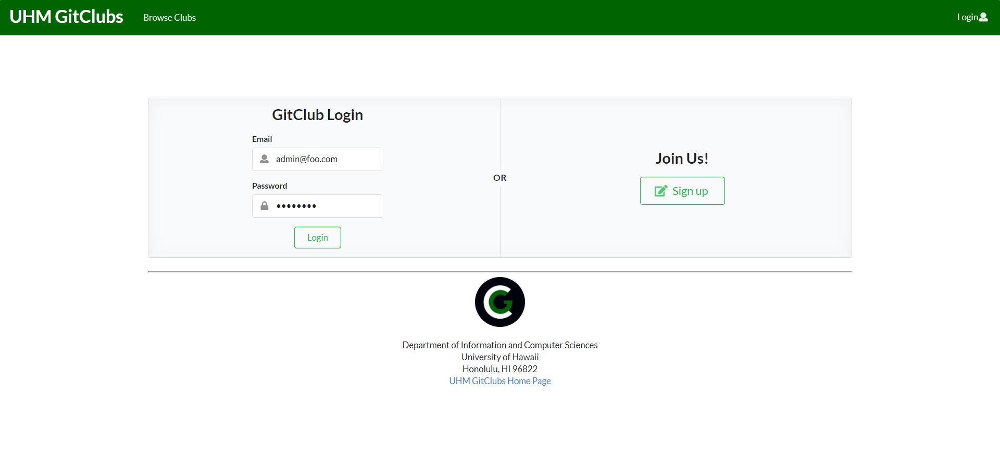
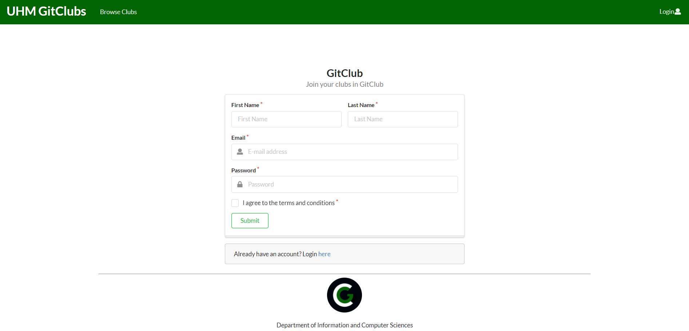
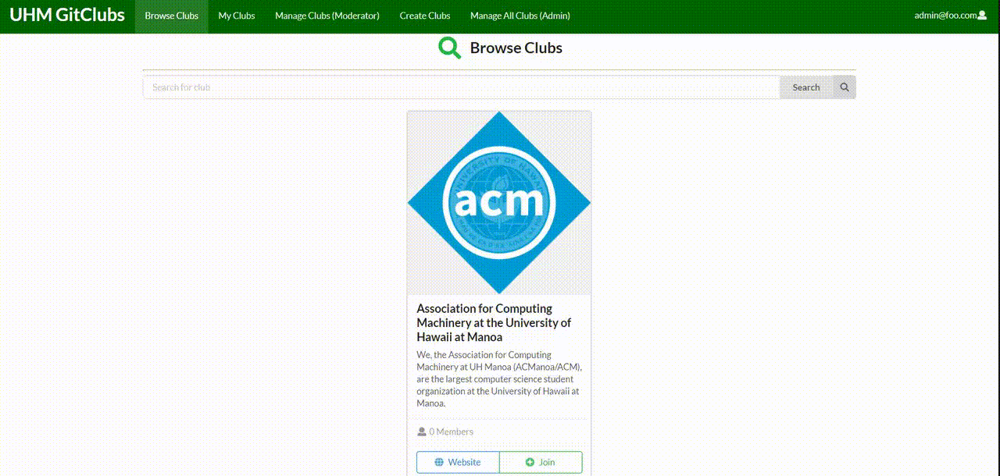
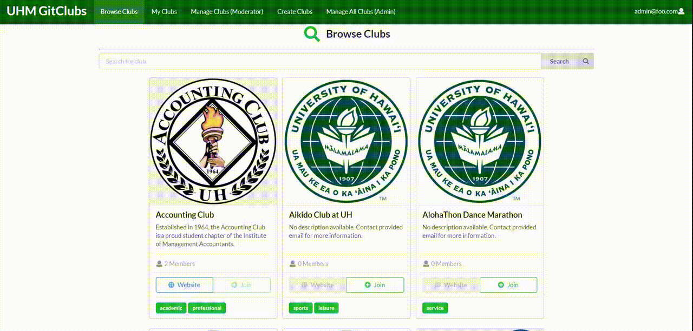
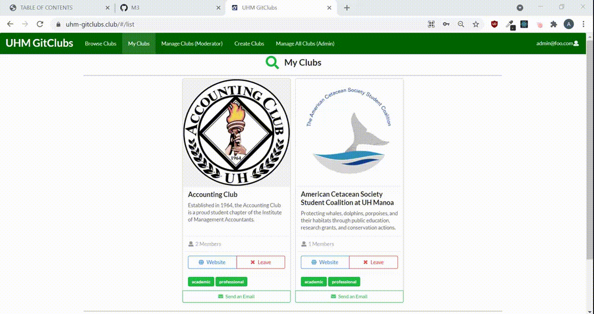
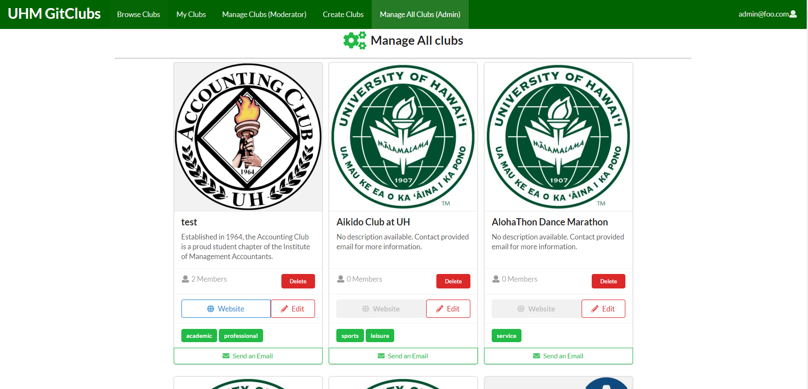
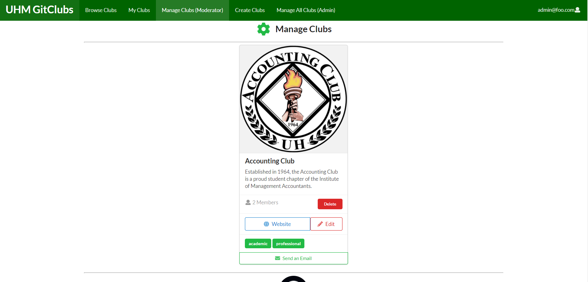
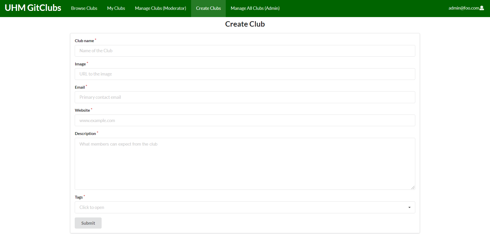
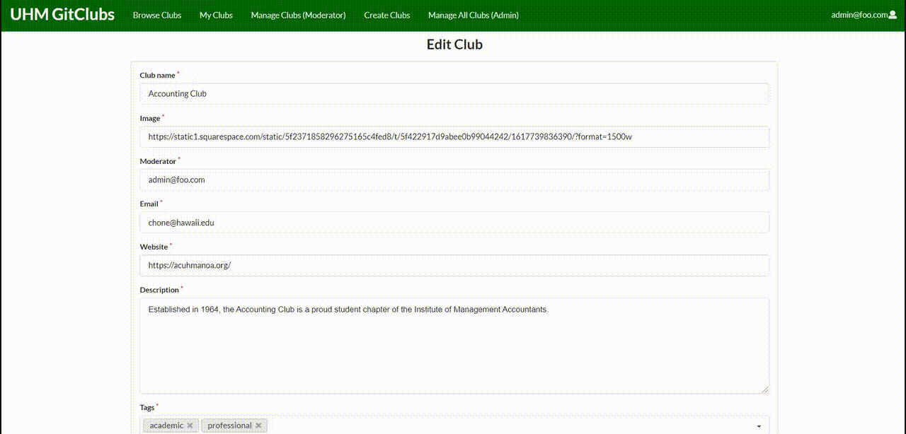

## TABLE OF CONTENTS
***
* [OVERVIEW](#overview)
* [LINKS](#links)
* [USER GUIDE](#user-guide)
* [DEVELOPER GUIDE](#developer-guide)
* [CONTINUOUS INTEGRATION](#continuous-integration)
* [DEVELOPMENT HISTORY](#development-history)
* [TEAM MEMBERS](#team-members)

<br/>

## OVERVIEW
***
UHM GitClubs is an application for UH Manoa students that provides a centralized directory for Registered Independent Organizations at UH Manoa. Anyone can visit the website to just browse the directory of clubs. The directory includes a description of the club, a link to their website, and contact information. Users are able to login and join a club from the directory.

Features:
- Join a club, and have a list of clubs that you are in
- Admins and club moderators can edit a club
- Admins can create or delete a club

<br/>

## LINKS
***
A link to the organization: [UHM GitClubs](https://github.com/uhm-gitclubs)

A link to the deployment: [uhm-gitclubs.club](https://uhm-gitclubs.club/#/)

<br/>

## USER GUIDE
***
This section provides a brief walkthrough of the UHM GitClubs user interface and its functionality.

### Landing Page

The first page seen when accessing the site. Provides a way to get to the directory of clubs and shows some statistics of the website. Also shows some clubs that the user may be interested in. Users can sign in/up from here.


### Signin, signout, signup

The user can login if they have an account, or they can register for one.





### Browse Clubs

This is the main directory of clubs. The user can see the name, image, description, and tags. They can also access the club website if available or add the club to their list of clubs. They can also search for a club by name or tag by using the search bar at the top of the page.


The user can also search for a club by name or tag by using the search bar at the top of the page.





### My Clubs

All users have access to a list of clubs that they have joined. Here they can email a club representative.



### Manage Clubs

Site admins can edit and delete all clubs. Club moderators can manage a club that they are a moderator of.





### Create & Edit Clubs

Site admins can create a new club. Site admins and club moderators can edit a club by going to the Manage Clubs page and editing it.





<br/>

## DEVELOPER GUIDE
***
This section provides information to Meteor developers who want to use this code as a basis for their own development projects and tasks.

1. Install [Meteor](https://www.meteor.com/install)
2. Go to the [UHM GitClubs](https://github.com/uhm-gitclubs/uhm-gitclubs) repository, and click the green "Code" dropdown to clone it to GitHub desktop.
3. cd into the ```uhm-gitclubs/app``` directory and install the required libraries with:
```
$ meteor npm install
```
4. Once the libraries are installed, the application can be run with:
```
$ meteor npm run start
```
The application should appear at [http://localhost:3000](http://localhost:3000). You can find the default users and login credentials in ```/config/settings.development.json```. To modify the clubs go to ```app/private/data.json```.

<br/>

## CONTINUOUS INTEGRATION
***
UHM GitClubs uses GitHub Actions to automatically run ESLint and TestCafe each time a commit is made to the default branch. You can see the results of all recent “workflows” at [https://github.com/uhm-gitclubs/uhm-gitclubs/actions](https://github.com/uhm-gitclubs/uhm-gitclubs/actions).


<br/>

## DEVELOPMENT HISTORY
***
We are tracking our progress using Milestones:

* [Milestone 1](https://github.com/uhm-gitclubs/uhm-gitclubs/projects/1)
* [Milestone 2](https://github.com/uhm-gitclubs/uhm-gitclubs/projects/3)
* [Milestone 3](https://github.com/uhm-gitclubs/uhm-gitclubs/projects/4)

### Milestone 1: Mockup and Deployment

* Implemented landing page
* Created mockup pages
* Deployed to Digital Ocean

### Milestone 2

* Implemented functionality various pages such as Edit/Create Club, Browse Clubs, Manage Clubs
* Added publications and schemas
* Added database for pages

### Milestone 3

* Implemented testing for all pages
* Get community feedback

<br/>

## COMMUNITY FEEDBACK
***
**Meghan N.**
- I really like the website idea! It was easy to navigate.
- You should allow users to click on "Join" even if they are not logged in, but direct them to the Login/Sign Up page.
- I liked the idea of "joining" the club, but it suggests that you can just join a club without being a member. A suggestion would be to say "subscribe" and allow the moderator of each club to add people to the member list. Side note: maybe the names and emails of the club memebrs can be visible to contact.
- When someone has already joined a club, the option to join on the Browse Clubs page is grayed out. A recommendation would for it to say "Leave" similar to the "My Clubs" page.
- When I hover over the number of members of each club, it turns blue which makes me think its a hyperlink.
- Maybe add more pictures or graphics to make the site less plain. The landing page was nice, but it seems that Browse Clubs, My Clubs, and login/sign up pages don't have formatting.
- It would be cool to see an option to filter results based on the tags.

**Andrei E.**
- I liked the website because it was obvious where we could find the information and what to click.
- Maybe have a dropdown menu for the tags when filtering.

**Danny P.**
- I think the website is super good!
- The landing page has random clubs at the bottom. When you press "join" on a club, the list of clubs refreshes again and gets randomized. I think it would be better if there was a randomize button instead, so users can click the "join" on multiple clubs without the list randomizing by itself.

**Aiden G.**
- I like the website's utility.
- The website was clean, clear, and easy to use.

**Antonio M.**
- The site was very good for the most part. Maybe you could implement alumni clubs and even other opportunities for students that have graduated.
- The website was formatted very well and could be useful for people who are searching for clubs.

**Geordan A.**
- I thought that the website was really smooth and the UI was very simple and easy to use. Very self explanatory. 
- My experience was very easy. The website was smooth and very easy to use. Anyone can be able to use the website even on mobile.

<br/>

## TEAM MEMBERS
***
The people collaborating to create this project are:

* [Yong U Cho](https://yongu2000.github.io)
* [Alvin Edrada](https://alvinedrada.github.io)
* [Cris Javier](https://crisjavier.github.io)
* [Mujtaba Quadri](https://mujtaba-a-quadri.github.io)
* [Leeden Raquel](https://leedenkraquel.github.io)

<br/>

[Back to top](#table-of-contents)
